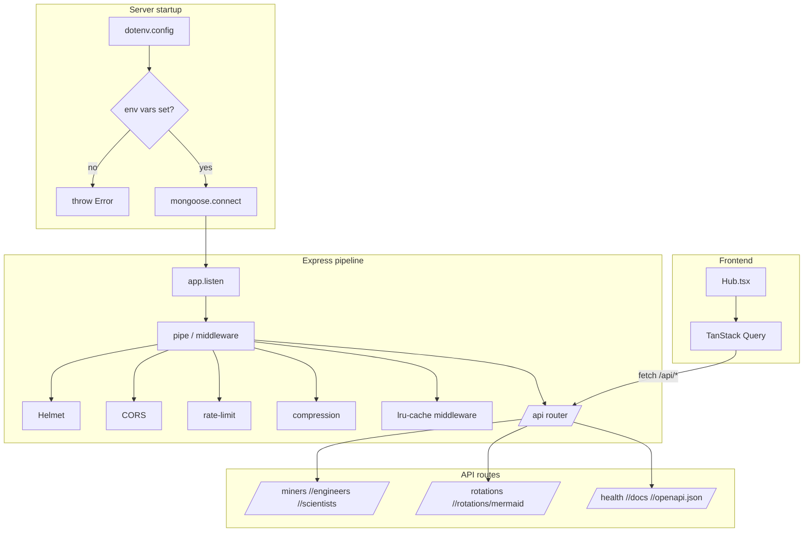
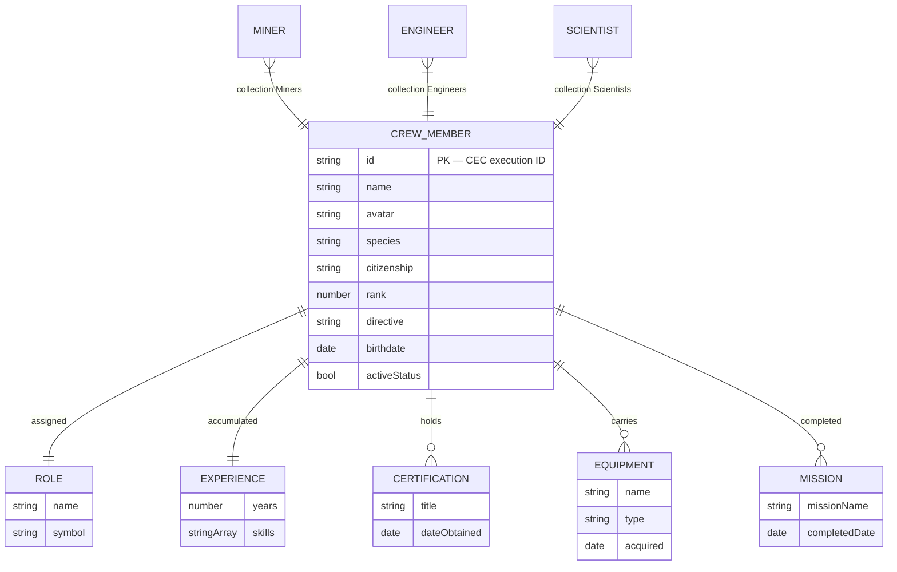

# DS_API — USG Ishimura CEC Store

[](https://github.com/ChewBaccaYeti/DS_API/actions/workflows/codeql.yml)
[](https://github.com/ChewBaccaYeti/DS_API/actions/workflows/deploy.yml)

Personal learning project themed after _Dead Space_. Three crew types (Miners,
Engineers, Scientists) live in MongoDB Atlas, served by Express and rendered by
a React SPA. Includes a **live crew rotation graph** that reshuffles assignments
every N hours.

## Table of contents

-   [Stack](#stack)
-   [Quick start](#quick-start)
-   [API surface](#api-surface)
-   [Architecture](#architecture)
-   [Entity model](#entity-model)
-   [Live crew rotation](#live-crew-rotation)
-   [Frontend](#frontend)
-   [Roadmap](#roadmap)

## Stack

-   **Backend:** Node.js, Express 4, Mongoose 8, TypeScript 5.
-   **Frontend:** React 18, React Router 6, TanStack Query 5, mermaid, Tailwind
    CSS 4 (in progress), Chakra Petch / Share Tech Mono / Orbitron typography.
-   **Data:** MongoDB Atlas (`CEC` database).
-   **Caching:** three layers — TanStack Query on the client, `Cache-Control`
    headers over HTTP, `lru-cache` in-memory on the server.
-   **Tooling:** webpack 5 dev server with `/api` proxy, Sass, PostCSS, Jest,
    ESLint, Prettier, Swagger UI (`/api/docs`).

## Quick start

```bash
npm install
cp .env.example .env   # fill Mongo credentials + ports
npm run deck           # compile + backend + frontend + watchers
```

Then open:

-   UI — <http://localhost:5376>
-   API root — <http://localhost:3842/api>
-   Swagger — <http://localhost:3842/api/docs>
-   Health — <http://localhost:3842/api/health>

## API surface

| Method | Path                                 | Notes                                          |
| ------ | ------------------------------------ | ---------------------------------------------- |
| `GET`  | `/api/`                              | Endpoint listing                               |
| `GET`  | `/api/health`                        | Liveness + Mongo readiness                     |
| `GET`  | `/api/docs`                          | Swagger UI                                     |
| `GET`  | `/api/openapi.json`                  | Raw OpenAPI spec                               |
| `GET`  | `/api/miners?page=1&limit=50`        | Paginated crew (`{items, page, limit, total}`) |
| `GET`  | `/api/engineers`                     | Same shape as `/miners`                        |
| `GET`  | `/api/scientists`                    | Same shape as `/miners`                        |
| `GET`  | `/api/rotations?slotHours=4`         | Slot metadata + JSON assignments               |
| `GET`  | `/api/rotations/mermaid?slotHours=4` | Mermaid flowchart (text/plain)                 |
| `GET`  | `/api/rotations/slot?slotHours=4`    | Current slot boundaries only                   |

All errors return the same envelope:

```json
{
    "error": { "code": "INTERNAL_ERROR", "message": "..." },
    "endpoint": "/api/miners",
    "status": 500,
    "timestamp": "2026-07-15T11:12:00.000Z"
}
```

## Architecture



## Entity model



Domain model lives in
[`CEC/ships/USG_Ishimura/crew/CEC.interface.ts`](CEC/ships/USG_Ishimura/crew/CEC.interface.ts).
The `CrewMember` interface and its value objects (`Role`, `Experience`,
`Certification`, `Equipment`, `Mission`) are `readonly` — mutation is done
through Mongoose, and the domain class `CrewPrototype` exposes typed business
methods (`isOfficer()`, `isActive()`, `lastCompletedMission()`,
`dumpRigData()`).

## Live crew rotation

Every `slotHours` (default 4 h) the API deterministically assigns each crew
member to a task from a canonical Dead Space task pool:

-   Junior crew (`rank < 4`) get a routine task; edge colour tells you which
    bucket they landed in (mining, engineering, medical, or off-duty).
-   Officers (`rank ≥ 4`) get their task written **inline on the edge**, and are
    pushed toward non-routine assignments 60 % of the time (autopsy command,
    reactor ops, foreman directive, and so on).
-   Inactive crew are always shown as off-duty.

The graph below is generated by
[`scripts/gen-rotation-snapshot.ts`](scripts/gen-rotation-snapshot.ts) and
refreshed via `npm run gen:rotation`. The live version updates itself every
minute at [`/rotations`](http://localhost:5376/rotations) in the UI.

```mermaid
---
config:
  theme: dark
  flowchart:
    curve: basis
    nodeSpacing: 60
    rankSpacing: 90
    padding: 30
    htmlLabels: true
---
flowchart LR
    %% Auto-generated slot 123896 (4h) — 2026-07-15T08:00:00.000Z
    MINING["Mining Deck<br/>Chief: Liam Brown<br/>Rank 7"]
    ENG["Engineering<br/>Chief: Liam Wilson<br/>Rank 5"]
    MED["Medical Bay<br/>Chief: Dr. Luca Icarus<br/>Rank 9"]
    MINING_MIN_010(["Mia Green<br/><i>Data Analyst</i><br/>R3"])
    MINING --> MINING_MIN_010
    MINING_MIN_003(["Alex Johnson<br/><i>Prospector</i><br/>R4"])
    MINING -->|"Blast Zone Command"| MINING_MIN_003
    MINING_MIN_006(["Sophia Lee<br/><i>Field Technician</i><br/>R4"])
    MINING -->|"Marker Site Recon"| MINING_MIN_006
    MINING_MIN_007(["Isabella Martinez<br/><i>Surveyor</i><br/>R6"])
    MINING -->|"Blast Zone Command"| MINING_MIN_007
    MINING_MIN_005(["Liam Brown<br/><i>Safety Officer</i><br/>R7"])
    MINING -->|"Foreman Directive"| MINING_MIN_005
    MINING_MIN_008(["Oliver Smith<br/><i>Environmental Scientist</i><br/>R5"])
    MINING -->|"Aegis VII Extraction Ops"| MINING_MIN_008
    MINING_MIN_009(["Ava Thompson<br/><i>Logistics Coordinator</i><br/>R4"])
    MINING -->|"Foreman Directive"| MINING_MIN_009
    MINING_MIN_002(["Jane Roe ⚠<br/><i>Geologist</i><br/>R3"])
    MINING --> MINING_MIN_002
    MINING_MIN_004(["Emma Wilson<br/><i>Driller</i><br/>R6"])
    MINING -->|"Aegis VII Extraction Ops"| MINING_MIN_004
    MINING_MIN_001(["John Doe<br/><i>Miner</i><br/>R5"])
    MINING -->|"Foreman Directive"| MINING_MIN_001
    ENG_ENG_009(["James Anderson<br/><i>Quality Assurance Engineer</i><br/>R4"])
    ENG -->|"Filter Swap"| ENG_ENG_009
    ENG_ENG_007(["Lucas Johnson<br/><i>Civil Engineer</i><br/>R4"])
    ENG -->|"Reactor Command"| ENG_ENG_007
    ENG_ENG_005(["Daniel Perez<br/><i>Software Engineer</i><br/>R3"])
    ENG --> ENG_ENG_005
    ENG_ENG_008(["Ava Martinez<br/><i>Systems Engineer</i><br/>R3"])
    ENG --> ENG_ENG_008
    ENG_ENG_010(["Liam Wilson<br/><i>Mining Engineer</i><br/>R5"])
    ENG -->|"Reactor Command"| ENG_ENG_010
    ENG_ENG_003(["Michael Walker<br/><i>Mechanical Engineer</i><br/>R4"])
    ENG -->|"Filter Swap"| ENG_ENG_003
    ENG_ENG_002(["Isabella Lewis<br/><i>Structural Engineer</i><br/>R4"])
    ENG -->|"RIG Diagnostic Sweep"| ENG_ENG_002
    ENG_ENG_001(["David Carter<br/><i>Lead Engineer</i><br/>R5"])
    ENG -->|"Off-duty (Rec Room)"| ENG_ENG_001
    ENG_ENG_004(["Emma Scott<br/><i>Electrical Engineer</i><br/>R5"])
    ENG -->|"ADS Cannon Ops"| ENG_ENG_004
    ENG_ENG_006(["Sophia Taylor<br/><i>Chemical Engineer</i><br/>R5"])
    ENG -->|"Wiring Patch"| ENG_ENG_006
    MED_SC_1006(["Dr. Helena Zimri<br/><i>Astrochemist</i><br/>R7"])
    MED -->|"Marker Bio-Signature Study"| MED_SC_1006
    MED_SC_1007(["Dr. Fenir Aegis<br/><i>Cyborg Specialist</i><br/>R8"])
    MED -->|"Outbreak Triage Command"| MED_SC_1007
    MED_SC_1003(["Dr. Yumi Nagata<br/><i>Geneticist</i><br/>R5"])
    MED -->|"Outbreak Triage Command"| MED_SC_1003
    MED_SC_1009(["Dr. Melina Ryker<br/><i>Nanotechnologist</i><br/>R7"])
    MED -->|"Off-duty (Chapel)"| MED_SC_1009
    MED_SC_1005(["Dr. Luca Icarus<br/><i>Neuroscientist</i><br/>R9"])
    MED -->|"Chief Med Consult"| MED_SC_1005
    MED_SC_1008(["Dr. Ethan Harker<br/><i>Quantum Physicist</i><br/>R6"])
    MED -->|"Necromorph Autopsy"| MED_SC_1008
    MED_SC_1001(["Dr. Elara T'Von<br/><i>Xenobiologist</i><br/>R7"])
    MED -->|"Bio-Waste Purge"| MED_SC_1001
    MED_SC_1010(["Dr. Karra Thorne<br/><i>Bioengineer</i><br/>R6"])
    MED -->|"Outbreak Triage Command"| MED_SC_1010
    MED_SC_1004(["Dr. Samara Wren<br/><i>Medical Doctor</i><br/>R6"])
    MED -->|"Vitals Round"| MED_SC_1004
    MED_SC_1002(["Prof. Alrik Voss<br/><i>Astrobiologist</i><br/>R8"])
    MED -->|"Marker Bio-Signature Study"| MED_SC_1002

    %% Legend (junior crew colour coding; officers labelled inline)
    subgraph LEGEND["Task Legend"]
        direction TB
        L_MINE["◆ Mining task"]
        L_ENG["◆ Engineering task"]
        L_MED["◆ Medical task"]
        L_OFF["◆ Off-duty"]
        L_CMD["◆ Officer command (rank ≥ 4)"]
    end
    class MINING deck_mining
    class ENG deck_eng
    class MED deck_med

    classDef deck_mining fill:#1a1408,stroke:#ffb03b,stroke-width:2px,color:#ffb03b
    classDef deck_eng fill:#0a1a1e,stroke:#4dd0e1,stroke-width:2px,color:#4dd0e1
    classDef deck_med fill:#1a0a0e,stroke:#c8102e,stroke-width:2px,color:#c8102e

    style LEGEND fill:#0d1218,stroke:#4dd0e1,color:#d7e6ef
    style L_MINE fill:#1a1408,stroke:#ffb03b,color:#ffb03b
    style L_ENG fill:#0a1a1e,stroke:#4dd0e1,color:#4dd0e1
    style L_MED fill:#1a0a0e,stroke:#c8102e,color:#c8102e
    style L_OFF fill:#141821,stroke:#5a6b78,color:#8ea2b0
    style L_CMD fill:#1a1428,stroke:#b47cff,color:#b47cff

    linkStyle 0 stroke:#5a6b78,stroke-width:1.5px,stroke-dasharray:4 4
    linkStyle 1 stroke:#b47cff,stroke-width:2.5px,stroke-dasharray:6 3
    linkStyle 2 stroke:#b47cff,stroke-width:2.5px,stroke-dasharray:6 3
    linkStyle 3 stroke:#b47cff,stroke-width:2.5px,stroke-dasharray:6 3
    linkStyle 4 stroke:#b47cff,stroke-width:2.5px,stroke-dasharray:6 3
    linkStyle 5 stroke:#b47cff,stroke-width:2.5px,stroke-dasharray:6 3
    linkStyle 6 stroke:#b47cff,stroke-width:2.5px,stroke-dasharray:6 3
    linkStyle 7 stroke:#5a6b78,stroke-width:1.5px,stroke-dasharray:4 4
    linkStyle 8 stroke:#b47cff,stroke-width:2.5px,stroke-dasharray:6 3
    linkStyle 9 stroke:#b47cff,stroke-width:2.5px,stroke-dasharray:6 3
    linkStyle 10 stroke:#4dd0e1,stroke-width:2px
    linkStyle 11 stroke:#b47cff,stroke-width:2.5px,stroke-dasharray:6 3
    linkStyle 12 stroke:#4dd0e1,stroke-width:2px
    linkStyle 13 stroke:#4dd0e1,stroke-width:2px
    linkStyle 14 stroke:#b47cff,stroke-width:2.5px,stroke-dasharray:6 3
    linkStyle 15 stroke:#4dd0e1,stroke-width:2px
    linkStyle 16 stroke:#b47cff,stroke-width:2.5px,stroke-dasharray:6 3
    linkStyle 17 stroke:#5a6b78,stroke-width:1.5px,stroke-dasharray:4 4
    linkStyle 18 stroke:#b47cff,stroke-width:2.5px,stroke-dasharray:6 3
    linkStyle 19 stroke:#4dd0e1,stroke-width:2px
    linkStyle 20 stroke:#b47cff,stroke-width:2.5px,stroke-dasharray:6 3
    linkStyle 21 stroke:#b47cff,stroke-width:2.5px,stroke-dasharray:6 3
    linkStyle 22 stroke:#b47cff,stroke-width:2.5px,stroke-dasharray:6 3
    linkStyle 23 stroke:#5a6b78,stroke-width:1.5px,stroke-dasharray:4 4
    linkStyle 24 stroke:#b47cff,stroke-width:2.5px,stroke-dasharray:6 3
    linkStyle 25 stroke:#b47cff,stroke-width:2.5px,stroke-dasharray:6 3
    linkStyle 26 stroke:#c8102e,stroke-width:2px
    linkStyle 27 stroke:#b47cff,stroke-width:2.5px,stroke-dasharray:6 3
    linkStyle 28 stroke:#c8102e,stroke-width:2px
    linkStyle 29 stroke:#b47cff,stroke-width:2.5px,stroke-dasharray:6 3
```

<!-- ROTATION-SNAPSHOT:START -->



_Snapshot generated 2026-07-15T11:39:06.741Z. Live version:
`GET /api/rotations/mermaid`._

<!-- ROTATION-SNAPSHOT:END -->

## Frontend

-   Route-level code splitting via `React.lazy` + `Suspense`.
-   Data fetching through `useCrew(role, {page, limit})` — TanStack Query
    handles caching, retries, and background revalidation.
-   HUD-styled UI: scanlines, vignette, corner-cut clip-paths, RIG cyan glow.
-   Custom `CrosshairCursor` replaces the system pointer.
-   Loading skeletons and typed `ErrorState` component for every crew route.

## Roadmap

See [ROADMAP.md](ROADMAP.md) for the full plan. Current milestones done:

-   **M1** — foundation cleanup (error envelope, health, Swagger UI, TS 5,
    `jsx: react-jsx`).
-   **M2** — frontend UX pass (TanStack Query, skeletons, error UI, lazy routes,
    pagination, cache).
-   **Rotation** — live rotation endpoint + roulette + mermaid renderer.

Next up: Vite migration, domain expansion (ships, necromorphs, weapons,
markers), auth (JWT + roles).
